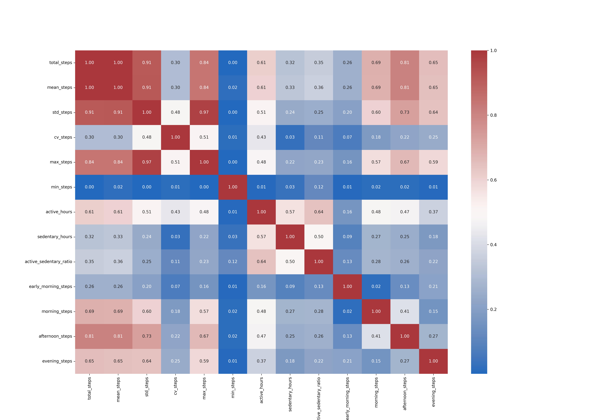
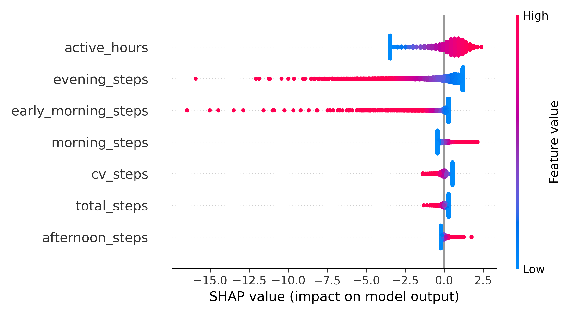
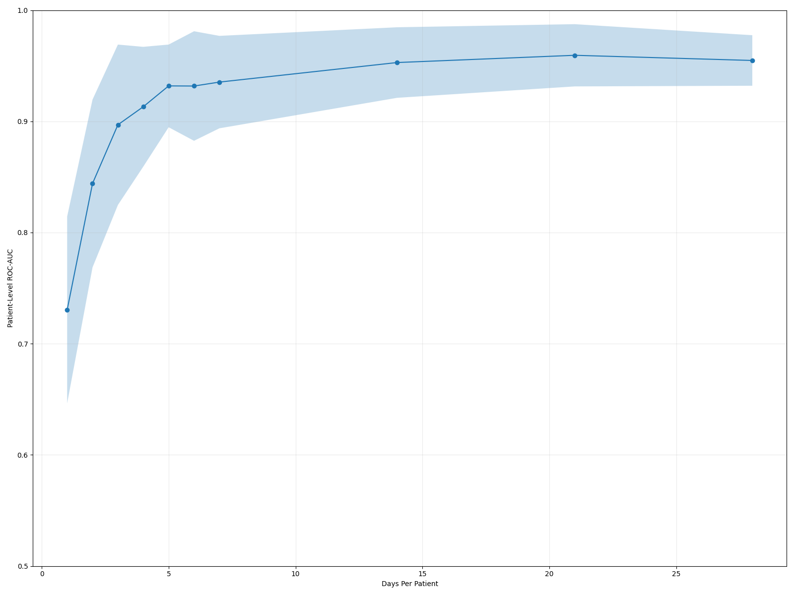
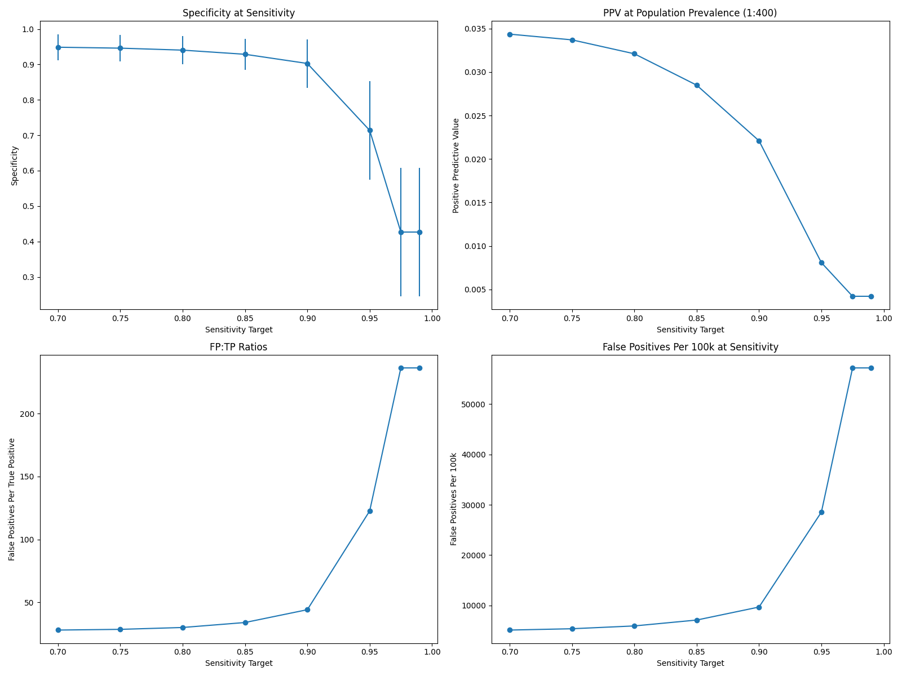

# Classification of Multiple Sclerosis Using Step Count Data from Wearable Devices

## Overview

Approximately 25,000 individuals in the US are diagnosed with multiple sclerosis (MS) every year. One common manifestation of the condition can be observed with changes in a person's gait, caused by MS-related nerve damage, fatigue, and muscle weakening. Because traditional screening measures for MS can be both time- and cost-prohibitive, combined with the rise of technology over the past decades, wearable data provides an interesting opportunity for a low-burden screening tool for the condition. Overall, this project explores if hourly step count data alone sufficiently distinguishes between MS patients and healthy controls and what a screening tool based on this data would look like in practice.

## Datasets

Datasets are not included in this repo for privacy reasons. Please download the datasets from the links below and place them in a `datasets/` folder before running this project.

1. [BarKA-MS](https://zenodo.org/records/17485784) - 44 MS patients, minute-level fitbit data (3.5 million rows, 7 columns).

2. [FitBit Fitness Tracker](https://www.kaggle.com/datasets/arashnic/fitbit) - 32 healthy individuals, hourly step data (45k rows, 3 columns)

3. [LifeSnaps](https://zenodo.org/records/7229547) - 71 healthy individuals, hourly multimodal data (160k rows, 39 columns)

Each dataset was stripped to contain only three variables: participant ID, steps, and datetime. Datasets were then tagged based on if the individuals in it were healthy or not. All three datasets were then merged. Each participant was capped at 720 hours (30 days) to help standardize the observation window.

## How to Run

### Packages

Run `setup.sh` or run the following command in your terminal:

```
python3 -m venv .venv
source .venv/bin/activate  # On Windows: .venv\Scripts\activate
pip install -r requirements.txt
```

### Run Order

Proceed with running the following notebooks in order

1. `project_code/merge_data.ipynb` - Loads, processes, and merges the three datasets

2. `project_code/feature_screening.ipynb` - Creates day level features, selects features through correlation analysis, fits logistic regression with 5-fold GroupKFold CV

3. `project_code/patient_stability.ipynb` - Looks at patient-level AUC across 1-28 days of observation

4. `project_code/screening_burden.ipynb` - Runs a 500-split screening tradeoff analysis under realistic MS prevalence (1:400)

Outputs (figures + csv) are saved to the `output` directory

## Decisions

1. Step count only - This decision was born from the constraint of inconsistent variables across datasets and the need to combine multiple datasets together to have a meaningful amount of data for modeling purposes.

2. 720-hour cap - This decision was made to prevent patients from any one dataset from contributing a disproportionate amount of data, which could lead to predictions biased towards that particular dataset's patterns.

3. Logistic regression - Chosen based on interpretability (for sanity checks), small sample size, and model training speed.

4. GroupKFold/GroupShuffleSplit - Meant to prevent data leakage, as the datasets are time series and we do not want individuals showing up in both the train and test split.

5. RobustScaler - As seen in the distribution plot, our variables are right-skewed, and RobustScaler is less sensitive to outliers compared to other methods.

## Example Output









## Citations

1. Baumer, A., von Wyl, V., Gonzenbach, R., Haag, C., & Sieber, C. (2025). BarKA-MS: Fitbit and Fatigue Data of People with Multiple Sclerosis during and after Rehabilitation [Data set]. Zenodo. https://doi.org/10.5281/zenodo.17485784

2. Yfantidou, S., Karagianni, C., Efstathiou, S., Vakali, A., Palotti, J., Giakatos, D. P., Marchioro, T., Kazlouski, A., Ferrari, E., & Girdzijauskas, Š. (2022). LifeSnaps: a 4-month multi-modal dataset capturing unobtrusive snapshots of our lives in the wild (Version 4) [Data set]. Zenodo. https://doi.org/10.5281/zenodo.7229547

3. Möbius. FitBit Fitness Tracker Data. Kaggle. https://www.kaggle.com/datasets/arashnic/fitbit/data